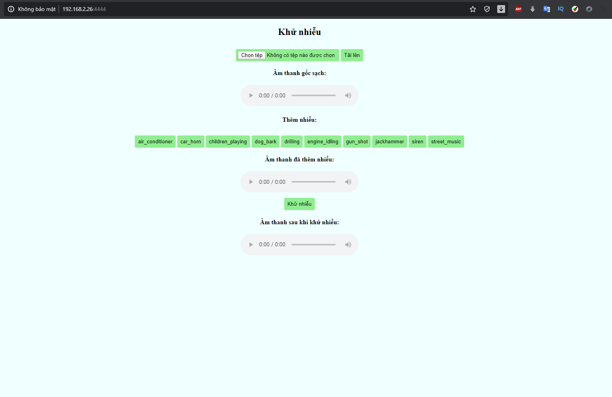

# Remove noise from speech use UNET with flask front end  

**step 1: tạo spectrogram voice và voise_noise**  
thay đổi dường dẫn, tham số trong file step1_make_data.py sau đó chạy lệnh:  
     python step1_make_data.py  
  
**step 2: train với spectrogram đã tạo**  
sửa đường dẫn tới thư mục spectrogram trong step2_train.py tới thư mục tạo bước 1
và thư mục lưu model khi train xong.  
     python step2_train.py  
  
**step 3: predict hoặc runserver**  
     python step3_predict.py  
     python step3_runserver.py  
  

